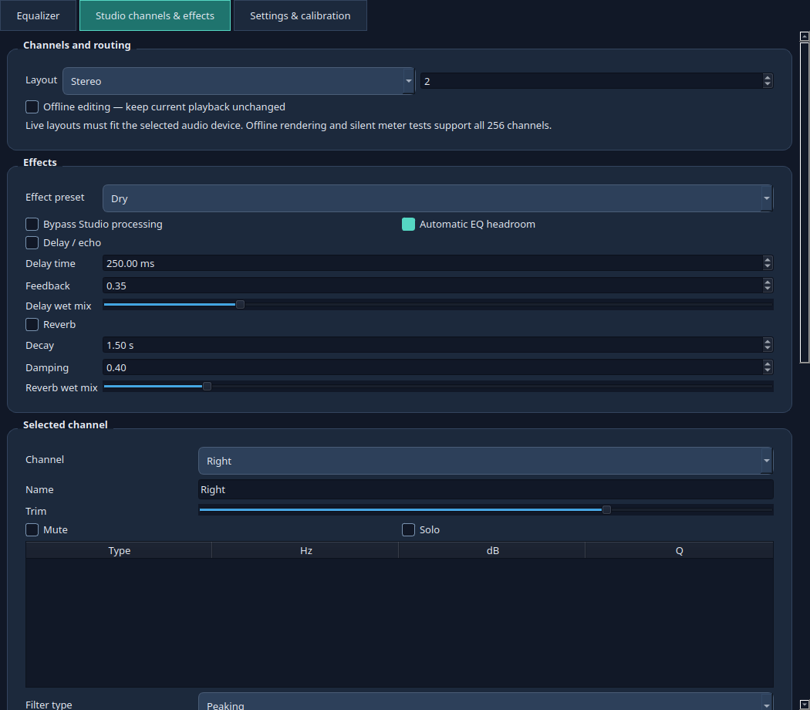

# SoundCurrent Studio

SoundCurrent Studio is the private C++ development line for the premium desktop
processor and a reusable audio library for a future DAW. It starts from
[SoundCurrent EQ](https://github.com/rhamenator/soundcurrent-eq), preserving its
source history, GPL-3.0-only license and third-party notices.

## Premium features

- **1–256 logical channels:** independent channel EQ, trim, mute, solo and names.
- **Routing:** explicit channel-to-channel gains, including polarity inversion.
- **Delay/echo:** 1–2000 ms, feedback and wet/dry mix.
- **Reverb:** decay, damping and wet/dry mix, with independent state per channel.
- **Effect presets:** dry, slapback, rhythmic echo, small room, warm/large hall,
  and echo with space. Every control can be adjusted beyond the preset.
- **Studio setups:** saved channel/effect/routing configurations, undo and lock.
- **Offline WAVE rendering:** apply the shared EQ and Studio settings to audio
  files, with optional effect tails, progress, cancellation and no-overwrite output.
- **Channel meters:** colored live output peaks and silent generated test signals.
- **Reusable C++20 SDK:** interleaved/planar buffers, exported CMake package, no Qt
  or device dependencies in the processing library.

The shared first-page EQ retains Flat as its default, 34 listening presets,
5–31 editable bands, post gain, balance, colored FFT meters and peak markers.
Speaker/amplifier profiles, microphone EQ, quiet sweep calibration with a preview,
automatic device selection, background operation and Quit are retained.



## Use

The **Equalizer** tab opens first, with the frequency controls at the top.
**Studio channels & effects** contains the premium controls;
**Settings & calibration** contains devices and measurements.

1. Use the shared EQ for the general listening curve. Per-channel filters add
   channel-specific corrections. Their combined limit is 64 filters per channel.
2. Choose a Studio layout and select a channel to edit its name, trim, mute/solo,
   additional filters and input routes. Negative routing gains invert polarity.
3. Enable delay or reverb, choose an effect preset, then adjust its controls.
   Settings take effect during playback without changing the listening preset.
4. Save the channel/effect/routing setup as a `.scstudio` file. Shared first-page
   listening presets are saved separately with **Save preset**.
5. Changing the channel count or loading a setup enables **Offline editing**.
   Current playback continues with its last live Studio configuration. Turn
   playback off before selecting a different live channel layout, then uncheck
   offline editing and enable playback through a compatible output device.
6. To test a large layout on a stereo machine, leave offline editing enabled and
   use the silent meter test or **Render audio file…**. A stereo input occupies
   the first two logical channels; additional channels are silent until routed.
   Inputs with more channels than the chosen layout are rejected rather than
   silently discarded. File rendering includes the current shared EQ/post gain.
7. The first-page **Lock controls** also protects Studio editing. Studio has its
   own undo history; Ctrl+Z on its tab undoes a Studio change. Wheel movement
   scrolls the active page instead of changing sliders or spin boxes.

Closing the window retains background processing when the notification area is
available. **Quit app** unloads processing and restores normal routing. The app
uses independent settings, activation sockets, shortcuts and installation paths
from SoundCurrent EQ. Quit EQ before enabling Studio on the same audio route.

### Live channel limits

The processing library, offline renderer and UI support 1–256 channels. Live
playback is limited by the selected device and driver. The Linux adapter uses
PipeWire, whose stream format supports up to 64 channels. The Windows adapter
uses the endpoint's WASAPI mix format and sample rate; the cable must expose the
input channels needed for the source. Extra logical channels do not manufacture
surround content, and unsupported output layouts are reported explicitly.

Delay and reverb currently have one settings set shared across channels, with
separate effect state on each channel. The processing order is EQ/headroom →
delay → reverb → trim/post gain → output clipping. Studio bypass skips that
processing, while the first-page on/off control unloads the live route.

## Installation

Private preview packages are built by this repository's release workflow.
The public EQ release is a separate application. Studio version 0.8.0 installs
with its own application icon and shortcuts.

### Ubuntu 24.04 and newer

```bash
sudo apt install ./soundcurrent-studio_*.deb
```

The package declares Qt, PipeWire and WirePlumber dependencies. A user-only
installation is also available when those dependencies are already installed:

```bash
./scripts/install-user.sh ./soundcurrent-studio_*.deb
```

### Fedora 44 and RHEL 10

Install the appropriate `.fc44` or `.el10` RPM:

```bash
sudo dnf install ./soundcurrent-studio-*.rpm
```

The RHEL-compatible package is built on AlmaLinux 10. Live audio requires a
PipeWire desktop session. RHEL 9 is not a build target.

### Windows 10/11 x64

Run `SoundCurrent-Studio-0.8.0-windows-x64-setup.exe`. It installs for the current
user, bundles Qt and the Microsoft runtime, and adds desktop/Start menu shortcuts.
The optional standard signed VB-CABLE setup is retained from the EQ installer;
restart Windows after installing the driver. Multichannel playback requires a
cable and physical endpoint that expose the needed channels. Simultaneous
microphone processing uses a separately installed second cable. The app itself
runs without administrator rights. VB-CABLE retains its vendor's separate terms.

Launch with `--preview` for an isolated UI session that starts without changing
playback or microphone routing. Offline rendering and silent meter tests do not
require a virtual cable or physical multichannel device.

## Build and test

Linux desktop dependencies: C++20 compiler, CMake 3.20+, Qt 6.4+ Core/Network/Widgets,
`pkg-config`, PipeWire development headers, Ninja (for the DEB script), and
Python 3 for WAVE tests. On Ubuntu:

```bash
sudo apt install build-essential cmake ninja-build qt6-base-dev libpipewire-0.3-dev
./scripts/build-deb.sh
ctest --test-dir build --output-on-failure
```

Windows desktop builds use Visual Studio 2022 C++ tools, CMake, 7-Zip and NSIS:

```powershell
./scripts/install-windows-qt.ps1
./scripts/build-windows.ps1 -QtPrefix C:\Qt\6.12.0\msvc2022_64
```

SDK/source/driver downloads use pinned checksums and official hosts. Windows
packages include corresponding Qt source and attribution notices.

Build just the reusable engine and offline CLI without Qt or a driver:

```bash
cmake -S . -B build-engine -DSOUNDCURRENT_BUILD_DESKTOP=OFF -DCMAKE_BUILD_TYPE=Release
cmake --build build-engine --config Release --parallel 2
ctest --test-dir build-engine -C Release --output-on-failure
cmake --install build-engine --config Release --prefix "$PWD/engine-sdk"
```

Other C++ projects use `find_package(SoundCurrentEngine 0.1 REQUIRED CONFIG)` and
link `SoundCurrent::Engine`. See [engine documentation](docs/studio-engine.md) and
the [independent consumer example](examples/engine_consumer).

## Verification

Synthetic engine/file tests cover mono through 256 channels, isolation, EQ,
effect tails, routing, invalid samples/files and allocation-free processing.
The shared UI check also exercises channel 256, effects, lock/undo, setup parsing
and a 256-channel file render. Linux live integration checks use a virtual
8-channel output, so no physical speakers or expensive receiver are required.
Windows desktop and audio checks run on an independent test VM.

See [premium coverage](docs/premium-features.md) and
[Windows verification](docs/windows-testing.md). These checks establish software
behavior. Real surround hardware still needs verification for speaker mapping,
latency, device changes and driver-specific formats before a production release.

## Privacy and bounded processing

Audio stays on the machine. The app has no telemetry or cloud audio uploads.
Only user-requested file renders persist processed audio. Setup files are bounded
to 8 MiB and their channel counts, filters, routing and effect parameters are
validated. Rendered audio is streamed in bounded blocks and published only after
success, without overwriting existing files. Cancellation discards partial output.
The engine limits prepared effect state to 128 MiB; standard RIFF/WAVE files have
a 4 GiB limit. The output filesystem must support hard links, such as ext4 or NTFS.

## Speaker and amplifier profiles

**Speaker model correction** is an independent layer added to the listening
preset and manual bands. Selecting **Flat** resets the listening bands;
selecting **None** removes the model correction. You can add **Bass Boost**,
**Loudness**, or your own low-frequency adjustments after choosing a model.
Speaker and amplifier selections participate in Undo and Lock EQ. The curve
and automatic headroom reflect the complete set of filters.

The offline catalog includes JBL 305P/306P/308P Mark II, Kali LP-6v2/LP-8v2,
ADAM T5V/T7V, Yamaha HS5/HS7/HS8, Edifier MR4, KRK RoKit 5 G4, KEF Q150/Q350,
ELAC Debut 2.0 B6.2 and Debut Reference DBR-62, Wharfedale Diamond 12.1, and
the **original Sony SS-CS5**. The Sony entry explicitly excludes **SS-CS5M2**:
no unverified substitute curve is supplied for that newer model.

These are conservative adaptations of [Spinorama AutoEQ](https://github.com/pierreaubert/spinorama)
with attribution to the original measurements. Positive filters below 80 Hz
are omitted, individual gains are capped at ±6 dB, and Q is capped at 6.
**Profile details** shows the applied filters and source links. They correct
published model response, without assuming the same room, positioning,
amplifier, unit variation, or microphone response as the original measurement.
Source files, provenance and exact upstream revision are in `data/speakers/`.

### Imported amplifier measurements

**Amplifier / receiver** defaults to None. No amplifier response is inferred
from a marketing frequency range. In particular, the Pyle PDA29BU specification
of 20 Hz–20 kHz is not a numerical correction curve. An electrical response
measurement can avoid microphone bias for amplifier correction, but its
speaker load, input path and tone settings must match the intended use.

Use **Import measured profile** to load a JSON file containing correction
filters derived from a published electrical measurement. The preview shows
the claimed source and conditions before applying it. The app validates file
size and numeric limits; it does not authenticate the source or measurement.
Imported profiles are stored locally. No network access or microphone recording
is needed to apply them.

Profile schema (illustrative values only; not a measured model):

```json
{
  "schema": 1,
  "model": "Exact amplifier model and revision",
  "measurementSource": "https://publisher.example/exact-measurement",
  "conditions": "8-ohm resistive load; RCA input; tone controls centered; 1 W",
  "filters": [
    {"type": "HS", "frequency": 8000, "gain": -1.0, "q": 0.707}
  ]
}
```

Use 1–16 `PK` (peaking), `LS` (low shelf), or `HS` (high shelf) filters,
frequencies from 20–20000 Hz, gain within ±6 dB, and Q from 0.1–6.
Files must be smaller than 64 KiB; at most 32 imported profiles are retained.
Gain is a **correction**, not the measured response itself. This EQ addresses
frequency response; it cannot remove amplifier noise, clipping or distortion.

